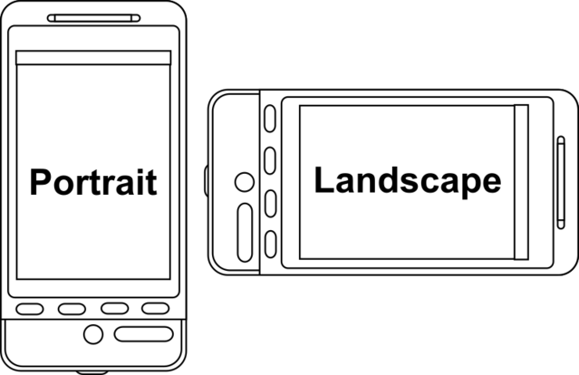

# Exercises: JavaScript First Steps

## Create a function that returns the largest number

Copy and paste the code below in a file named `largest-number.html`, and try to update the JS part:

**largest-number.html**:

```html
<!DOCTYPE html>
<html lang="en">
<head>
  <meta charset="UTF-8">
  <meta name="viewport" content="width=device-width, initial-scale=1.0">
  <title>Largest Number</title>
</head>
<body>
  <h1>Largest Number</h1>
  <script src="largest-number.js"></script>
</body>
</html>
```

**largest-number.js**:

```js
function findMaxNumber(num1, num2){
  // YOUR CODE HERE >>
  // << YOUR CODE HERE
}

// RUNNING & TESTING OUR findMaxNumber() FUNCTION:
// Don't worry about the code below. It's just there to test your code above.
const checkMax1 = findMaxNumber(10, 5);
console.log('Max Number 1:',checkMax1);
console.assert( checkMax1 === 10, "Ops, was expecting 10, got ", checkMax1);

const checkMax2 = findMaxNumber(10, 15);
console.log('Max Number 2:',checkMax2);
console.assert( checkMax2 === 15, "Ops, was expecting 15, got ", checkMax2);

const checkMax3 = findMaxNumber(100, 100);
console.log('Max Number 3:',checkMax3);
console.assert( checkMax3 === 100, "Ops, was expecting 100, got ", checkMax3);
```

When you're ready, move the 2 files (`largest-number.html`, `largest-number.js`) in the following path `user/week01/exercises/day05/javascript-first-steps/` and run the git commands below to submit your exercise:

- `git add user/week01/exercises/day05/javascript-first-steps/`
- `git commit -m "javascript-largest-number"`
- `git push`

## Create a function that detects landscape mode 

"Page orientation is the way in which a rectangular page is oriented for normal viewing. The two most common types of orientation are portrait and landscape."



Create a function that accepts two arguments, a picture's `width` and `height` and returns a Boolean (`true/false`) depending on whether the picture is in landscape mode or not.

Copy and paste the code below in a file named `landscape-mode.html`, and try to update the JS part:

```html
<!DOCTYPE html>
<html lang="en">
<head>
  <meta charset="UTF-8">
  <meta name="viewport" content="width=device-width, initial-scale=1.0">
  <title>Landscape Mode Checker</title>
</head>
<body>
  <h1>Landscape Mode Checker</h1>
  <script src="landscape-mode.js"></script>  
</body>
</html>
```

**landscape-mode.js**:

```js
// YOUR CODE HERE >>
function isLandscape(width, height){
  return (width > height);
}
// << YOUR CODE HERE

// Don't worry about the code below. It's just there to test your code above.

// RUNNING & TESTING OUR isLandscape() FUNCTION:
console.assert( isLandscape, "Expecting isLandscape to be defined" );
console.assert( typeof isLandscape === "function", "Expecting isLandscape to be a function" );

const checkWidthHeight1 = isLandscape(800, 600);
console.log('Landscape:',checkWidthHeight1); 
console.assert( checkWidthHeight1 === true, "Ops! Was expecting true.")

const checkWidthHeight2 = isLandscape(600, 800);
console.log('Landscape:',checkWidthHeight2); // Should be true
console.assert( checkWidthHeight2 === false, "Ops! Was expecting false.")

const checkWidthHeight3 = isLandscape(1024, 768);
console.log('Landscape:',checkWidthHeight3); // Should be true
console.assert( checkWidthHeight3 === true, "Ops! Was expecting true.")
```

When you're ready, move the files in the following path `user/week01/exercises/day05/javascript-first-steps/` and run the git commands below to submit your exercise:

- `git add user/week01/exercises/day05/javascript-first-steps/`
- `git commit -m "javascript-landscape-mode"`
- `git push`

----

### Sources and Attributions

**Content is based on the following sources:**

- [Wikipedia: Page orientation](https://en.wikipedia.org/wiki/Page_orientation)